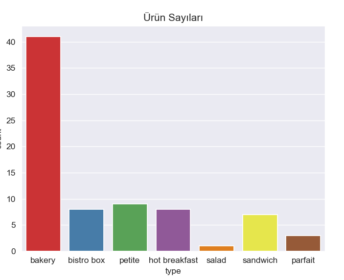
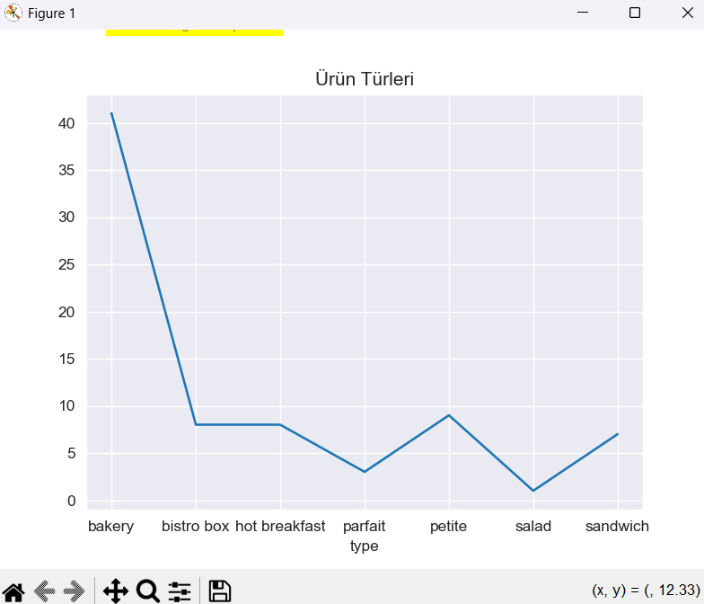
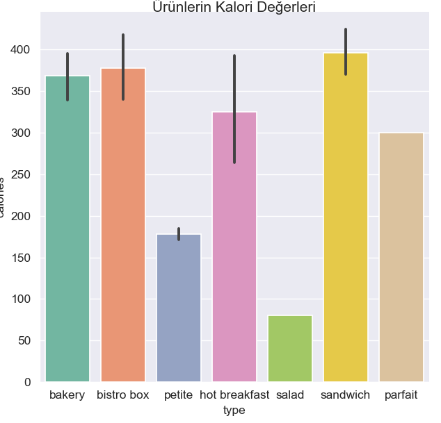
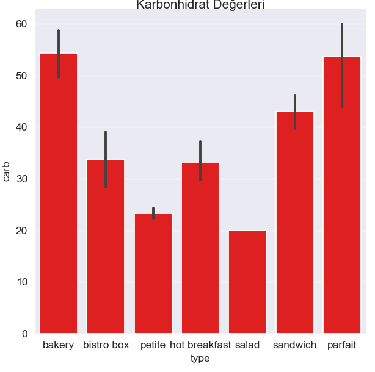
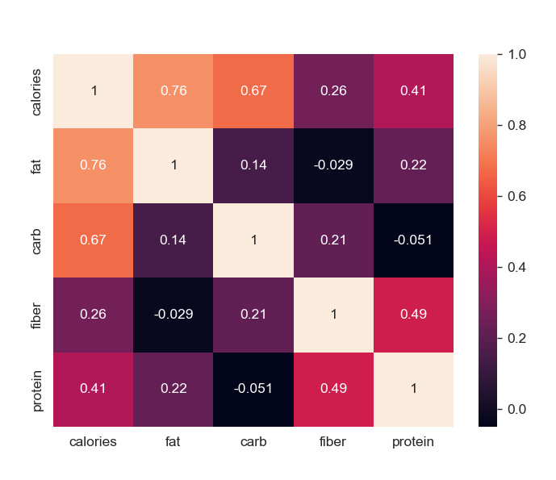
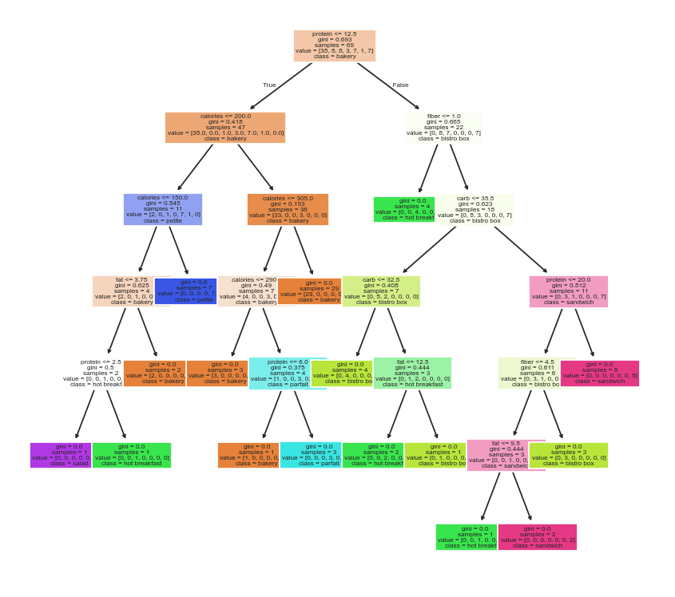

# Starbucks Ürünleri Besin Değeri Analizi ve Sınıflandırma 
Bu proje, Starbucks menüsündeki çeşitli yiyecek ve içeceklerin besin değerlerini (kalori, yağ, protein, karbonhidrat, lif) detaylı bir şekilde incelemek ve görselleştirmek amacıyla oluşturulmuştur. Ayrıca, bir ürünün besin değerlerine bakarak hangi kategoriye (type) ait olduğunu tahmin eden bir makine öğrenmesi modeli geliştirilmiştir.

## Veri Kaynağı ve Araçlar
**Veri Seti:** Analizde kullanılan veri seti, Kaggle'dan elde edilen starbucks.csv dosyasıdır.

**Kullanılan Kütüphaneler:** Pandas, NumPy, Matplotlib, Seaborn, Scikit-learn (sklearn).

## Analizler ve Görselleştirmeler
Proje kapsamında çeşitli analizler ve görselleştirmeler yapılmıştır. Öne çıkan bulgular aşağıdadır:

**1. Ürün Türleri Dağılımı**

En fazla ürün çeşidine sahip kategorinin "Bakery" olduğu görülmüştür.

  
  

**2. Kalori ve Protein Değerleri**

Ortalama kalori değeri en yüksek ürün kategorileri "Bakery" ve "Sandwiches" olarak belirlenmiştir.

Protein değeri açısından "Sandwiches" ve hemen ardından "Bistro box" kategorileri diğer kategorilere kıyasla daha zengindir.

En fazla ürün çeşidine sahip kategorinin "Bakery" olduğu görülmüştür.

  
  

## 3. Korelasyon Analizi

Sayısal değişkenler arasındaki korelasyonlar incelenmiştir. 

  

## Makine Öğrenmesi Modeli
**Amaç:** 
Bir ürünün kalori, yağ, karbonhidrat, lif ve protein değerlerine bakarak hangi type (kategori) olduğunu tahmin eden bir makine öğrenmesi modeli geliştirilmiştir.

**Model Tipi:** 
Karar Ağacı Sınıflandırıcısı (DecisionTreeClassifier) kullanılmıştır.

**Model Başarısı:** 
Model, test verileri üzerinde %75'lik bir doğruluk oranı (accuracy) elde etmiştir.

## Modelin Görselleştirilmesi
Aşağıda, eğitilmiş olan Karar Ağacı modelinin görsel bir temsilini bulabilirsiniz. Bu görsel, modelin hangi özelliklere (calories, fat, carb, fiber, protein) göre nasıl kararlar verdiğini ve ürünleri farklı kategorilere ayırdığını net bir şekilde göstermektedir.

